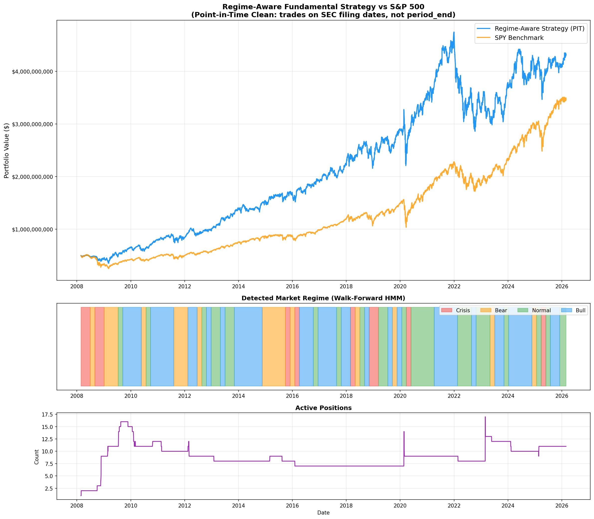

<p align="center">
  <h1 align="center">Regime-Aware Factor Backtest</h1>
  <p align="center">
    <strong>A point-in-time clean, bias-free quantitative equity strategy</strong><br/>
    Walk-forward HMM regime detection · SEC filing-gated fundamentals · Fama-French 5-Factor attribution
  </p>
</p>

<p align="center">
  
  
  
  
  
</p>

---

## Performance Summary (2008–2026)

| Metric | Strategy | SPY Benchmark | Δ |
|:---|---:|---:|---:|
| **Total Return** | **763.0%** | 592.4% | +170.6% |
| **Annual Return** | **12.73%** | 11.36% | +1.37% |
| **Sharpe Ratio** | **0.61** | 0.57 | +0.04 |
| **Max Drawdown** | **-39.74%** | -51.48% | **+11.74%** |
| **Volatility** | 20.82% | 19.89% | +0.93% |

> All returns are **net of fees**: 2% annual management fee (monthly on AUM) + 15% performance fee (quarterly, high-water mark). Set both to `0.0` in `config.py` for gross-of-fee results.

<details>
<summary><strong>📊 Full Fee Breakdown</strong></summary>

| Fee Component | Total |
|:---|---:|
| Transaction Costs | $60.0M |
| Management Fees (2% PA) | $1,003.8M |
| Performance Fees (15% HWM) | $1,007.9M |
| **Total All Costs** | **$2,071.7M** |

*Initial capital: $500M. 230 total trades over 18 years.*

</details>

### Equity Curve & Drawdown




---

## Fama-French 5-Factor Attribution

OLS regression on daily excess returns decomposes performance into systematic factor exposures and residual alpha.

| Factor | Loading | Interpretation |
|:---|---:|:---|
| **Alpha (Annualized)** | **2.42%** | Net-of-fee residual (t=0.91, p=0.365) |
| **Alpha (Gross, First Half)** | **8.37%** | t=2.73, **p=0.006** ✱✱ |
| Market (Mkt-RF) | 0.85 | Defensive beta (<1.0) |
| Size (SMB) | 0.18 | Moderate small-cap tilt |
| Value (HML) | -0.09 | Negligible |
| Quality (RMW) | 0.06 | Slight positive quality loading |
| Investment (CMA) | -0.08 | Negligible |
| **R²** | **0.71** | Five factors explain 71% of variance |

### Sub-Period Robustness

| Period | Alpha | t-stat | p-value | Sharpe |
|:---|---:|---:|---:|---:|
| **First Half (2008–2017)** | 8.37% | 2.73 | **0.006** | 0.84 |
| **Second Half (2017–2026)** | -3.44% | -0.78 | 0.435 | 0.41 |

The alpha was concentrated in the post-GFC period when the leverage-aversion premium was strongest. As low-leverage quality became a more crowded factor, marginal alpha compressed — consistent with factor lifecycle theory.

---

## Bias Mitigation Framework

This codebase enforces **four layers** of bias prevention to ensure historical results approximate real-time achievability.

### 1. Point-in-Time Fundamental Knowledge
`rank_system_v2.py` triggers ranking re-evaluations strictly on SEC `acceptance_datetime` (`asof_date`), tracking exactly when reports reach the public domain. Fallback: `period_end + 60 days` — a conservative penalty preventing futuristic front-running.

### 2. Walk-Forward Regime Detection
`regime_detector.py` trains the HMM exclusively on `spy.loc[:t-1]`. The scaler statistics, HMM parameters, and regime label mappings are all fit within the walk-forward window. No Viterbi full-path decoding — only trailing prediction.

### 3. Survivorship Bias Handling
`regime_aware_backtest.py` monitors held positions for consecutive NaN price days. After 20 consecutive missing days, the position is force-liquidated at a **-30% penalty** from the last known price — addressing delistings and bankruptcies.

### 4. Regime-Specific Transaction Costs
Spreads scale with market stress: 80/100 bps (crisis) → 10/12 bps (bull). This reflects real market microstructure — spreads widen during stress.

---

## Strategy Mechanics

### Ranking Engine (`rank_system_v2.py`)

Identifies top companies by evaluating 4 fundamental markers, each smoothed with a 4-period EWMA (α ≈ 0.4):

| Weight | Factor | Formula | Rationale |
|---:|:---|:---|:---|
| 30% | **ROIC** | EBIT / Invested Capital | Operating efficiency pre-tax |
| 25% | **Leverage Aversion** | 1/(D/E + 1) ∈ [0,1] | Core thesis — crisis resilience |
| 25% | **FCF Margin** | (CFO − \|CapEx\|) / Revenue | Cash generation efficiency |
| 20% | **Revenue Growth** | YoY revenue change | Business momentum |

### Regime Execution (`regime_aware_backtest.py`)

```
                 ┌─────────────────────────┐
                 │   SEC Filing Arrives     │
                 │   (asof_date gate)       │
                 └──────────┬──────────────┘
                            │
                 ┌──────────▼──────────────┐
                 │   Recompute PIT         │
                 │   Rankings (EWMA)       │
                 └──────────┬──────────────┘
                            │
              ┌─────────────┼─────────────┐
              ▼             ▼             ▼
        ┌──────────┐ ┌──────────┐ ┌──────────┐
        │ Rank Drop│ │ Top-N    │ │ Rank     │
        │ Liq/Trim │ │ Rebalance│ │ Jump     │
        └──────────┘ └──────────┘ └──────────┘
                            │
              ┌─────────────▼─────────────┐
              │   Crisis/Bear Regime?     │
              │   → Panic-Buy Overlay     │
              │   (drawdown + rank check) │
              └───────────────────────────┘
```

- **Rank >18**: Full liquidation
- **Rank 15–18**: 50% trim per rank lost (only on rank *change*)
- **Rank jump ≥15**: $200K additional capital
- **Rank jump ≥25**: $500K additional capital
- **Crisis dip-buy**: 20% capital increase on -10% drawdown + retained rank

### Regime Distribution

| Regime | Days | % of Backtest |
|:---|---:|---:|
| Bull | 2,004 | 44.2% |
| Normal | 1,232 | 27.2% |
| Bear | 819 | 18.1% |
| Crisis | 476 | 10.5% |

---

## Architecture

```
Regime-Aware-Factor-Backtest/
├── config.py                    # All tunable parameters (254 lines, fully documented)
├── rank_system_v2.py            # PIT fundamental ranking engine
├── regime_detector.py           # Walk-forward HMM (4 regimes, volatility-sorted)
├── regime_aware_backtest.py     # Main backtest engine (1,500 lines)
├── adaptive_engine.py           # Drawdown manager, alpha fade, WF optimizer
├── options_hedge.py             # Regime-conditional put spread overlay (synthetic BS)
├── run_experiments.py           # Batch experiment runner
├── requirements.txt             # Dependencies
├── historical_data/             # Parquet fundamentals from chrono-fund engine
│   ├── statements_income.parquet
│   ├── statements_balance.parquet
│   ├── statements_cashflow.parquet
│   └── filings.parquet          # SEC acceptance_datetime lookup
├── results/                     # Output charts, trade logs, metrics
│   ├── backtest_results.png
│   ├── drawdown_analysis.png
│   ├── trading_analysis.png
│   ├── metrics.json             # Machine-readable full results
│   ├── daily_history.csv
│   ├── trade_log.csv
│   ├── fee_log.csv
│   ├── hedge_log.csv
│   └── hedge_daily.csv
├── price_data.parquet           # Cached Yahoo Finance prices
├── ff5_data.parquet             # Cached Fama-French 5-Factor data
└── vix_rf_cache.parquet         # Cached VIX/SPY/RF for synthetic pricing
```

### Module Dependency Graph

```
config.py ◄──────────────────────────────┐
    ▲                                    │
    │                                    │
rank_system_v2.py                        │
    ▲                                    │
    │                                    │
regime_detector.py                       │
    ▲                                    │
    │          ┌───────────────────┐     │
    │          │ adaptive_engine.py│─────┘
    │          └────────┬──────────┘
    │                   │
    │          ┌────────▼──────────┐
    └──────────┤ regime_aware_     │
               │ backtest.py       │
    ┌──────────┤ (main entry)      │
    │          └───────────────────┘
    │
    ▼
options_hedge.py
```

---

## Optional Overlays

All overlays are behind config flags for clean A/B testing. Set any to `True` in `config.py`:

| Overlay | Flag | Description |
|:---|:---|:---|
| **Options Hedge** | `ENABLE_OPTIONS_HEDGE` | Regime-conditional put spread overlay using VIX-based synthetic BS pricing |
| **Drawdown Scaling** | `ENABLE_DRAWDOWN_SCALING` | Reduce exposure proportionally as drawdown deepens |
| **Alpha Fade** | `ENABLE_ALPHA_FADE` | Blend toward passive SPY when rolling 12-month alpha turns negative |
| **Adaptive Weights** | `ENABLE_ADAPTIVE_WEIGHTS` | Walk-forward re-optimization of scoring weights |
| **Vol Targeting** | `ENABLE_VOL_TARGETING` | Scale exposure to maintain target annualized volatility |
| **Trailing Stops** | `ENABLE_TRAILING_STOPS` | Regime-specific trailing stop-losses per position |
| **Benchmark Blend** | `ENABLE_BENCHMARK_BLEND` | Static strategy/SPY blend (configurable ratio) |

---

## Quick Start

```bash
# Clone
git clone https://github.com/tanishhky/Regime-Aware-Factor-Backtest.git
cd Regime-Aware-Factor-Backtest

# Setup
python3 -m venv venv && source venv/bin/activate
pip install -r requirements.txt

# Run (uses cached rankings + prices for fast iteration)
python regime_aware_backtest.py
```

Output is written to `results/` including charts, trade log, daily history, and `metrics.json` with full FF5 attribution.

### Key Configuration

```python
# config.py — most impactful parameters
INITIAL_CAPITAL         = 500_000_000   # Starting capital
TOP_N_INVEST            = 10            # Portfolio concentration
N_REGIMES               = 4             # HMM states
REGIME_TRAIN_WINDOW     = 756           # ~3 years rolling HMM
FALLBACK_REPORTING_LAG  = 60            # Conservative PIT fallback (days)
DELISTING_RETURN        = -0.30         # Assumed delisting loss
MANAGEMENT_FEE_ANNUAL   = 0.02          # 2% PA
PERFORMANCE_FEE_RATE    = 0.15          # 15% of profits above HWM
```

---

## Known Limitations

- **Alpha concentration**: Statistically significant alpha is in the 2008–2017 period. Second-half alpha does not reach significance, suggesting leverage-aversion premium compression.
- **Parameter count**: ~15 tunable parameters selected on a single historical path. No formal sensitivity analysis.
- **Concentrated portfolio**: 10 stocks carry meaningful idiosyncratic risk.
- **SMB exposure**: Positive small-cap loading (0.18) means part of outperformance comes from size factor.
- **Universe limitation**: Rankings are computed over tickers in the fundamental dataset, which may have partial survivorship bias in the screening universe (though held-position delistings are handled).
- **HMM instability**: 4 regimes × 4 features = ~48 parameters on 756 training observations.
- **Options hedge**: Portfolio-level SPY puts, not single-stock. Idiosyncratic blowups are not hedged.

---

## Dependencies

```
pandas, numpy, yfinance, matplotlib, hmmlearn, scikit-learn,
statsmodels, pandas-datareader, scipy, tqdm
```