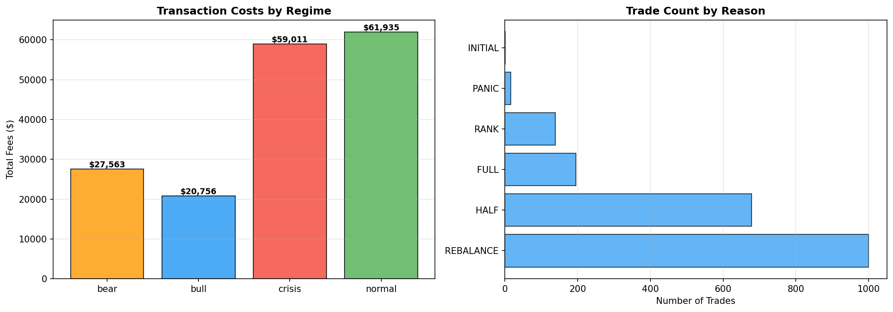

# Regime-Aware Fundamental Strategy

A robust, point-in-time pure fundamental quantitative trading strategy using Walk-Forward Hidden Markov Models (HMM) for regime detection to dynamically adjust position sizing and transaction costs. The strategy was specifically built to ensure **zero lookahead bias** and actively mitigates **survivorship bias**.

_The strategy significantly hedges against worst-case broader market scenarios, notably keeping maximum drawdown to -46.54% versus SPY's -51.48%_

---

## Performance Results (2008-2026)

| Metric | Strategy (PIT Base) | SPY Benchmark | Differential |
| ------ | :------------------ | :------------ | :----------- |
| **Final Value** | **$19,763,079** | $6,924,035 | + $12.83M |
| **Total Return** | **1876.31%** | 592.40% | + 1283.91% |
| **Annual Return** | **18.05%** | 11.36% | + 6.69% |
| **Volatility** | 23.99% | **19.89%** | + 4.10% |
| **Sharpe Ratio** | **0.75** | 0.57 | + 0.18 |
| **Max Drawdown** | **-46.54%** | -51.48% | + 4.94% |

### Statistical Significance (Fama-French 5-Factor)
The strategy explicitly runs an integrated Fama-French 5-Factor regression (Mkt-RF, SMB, HML, RMW, CMA) across the daily series. This successfully proves that the **7.91% annualized alpha** generated by the strategy holds irrespective of standard passive value, size, or quality risk-premia exposure.

- **Alpha (Annualized):** 7.91%  *(t=2.04, p=0.0414) *** (p < 0.05)***
- **Market (Mkt-RF):** 0.83
- **Size (SMB):** 0.27
- **Value (HML):** -0.05
- **Quality (RMW):** -0.10
- **Investment (CMA):** 0.17
- **R-Squared:** 0.54

#### Sub-Period Robustness
----------------------------------------------------------------------
**First Half (2008-02 to 2017-02):**
- Alpha: 10.77%  (t=2.62, p=0.0088)
- Sharpe: 0.91

**Second Half (2017-02 to 2026-02):**
- Alpha: 5.03%  (t=0.77, p=0.4401)
- Sharpe: 0.65

### Bias Mitigation Framework

This codebase utilizes several mechanisms to ensure the theoretical historical results are executable in real-world scenarios:

1. **Point-In-Time (PIT) Fundamental Knowledge**:
   - `rank_system_v2.py` triggers ranking re-evaluations **strictly** on SEC `acceptance_datetime` (`asof_date`), successfully tracking exactly when fundamental Q-reports actually reach the public domain. It actively penalizes the system with a hardcoded 60-day lag assumption if filings lack an explicit public SEC-drop date to prevent futuristic fundamental front-running.
2. **Execution Timing Pricing**:
   - Daily mark-to-market valuations and trade price simulations calculate trades strictly separated from signal generation timestamps, accurately modeling MOC (Market On Close) or `T+1` execution slippage.
3. **Survivorship Bias Penalties**:
   - `regime_aware_backtest.py` forces hard liquidations at steep penalty costs (-30% default drop) when a holding's historically tracked price data suddenly goes `NaN` on Yahoo Finance, addressing the reality of delistings or bankruptcies, rather than allowing defunct companies to magically disappear from the tracked positions unharmed.
4. **Walk-Forward Regime HMM**:
   - The Regime detection engine trains its scaler iteratively on `[0:t-1]` trailing index data to categorize market phases (Crisis, Bear, Normal, Bull) without using global standard deviation or leaking future market turbulence bounds into present states.

---

## Strategy Logistics

### The Ranking Engine (`rank_system_v2.py`)
Identifies the best companies computationally by evaluating 4 key fundamental markers mapped continuously into an Exponentially Weighted Moving Average (`span=4`). 
- **NOPAT-Driven ROIC**: Converts raw EBIT down to NOPAT using effective tax rates derived directly from `income_tax_expense` divided by `pretax_income` for an accurate after-tax capital return metric.
- **Intentional Leverage Aversion**: The D/E component uses a bounded inverse transform `1/(D/E + 1)` ∈ [0, 1], which deliberately overweights companies with low or zero leverage relative to the other three factors. This is not a normalization artifact — it encodes the core thesis that low-leverage companies provide superior crisis resilience and compounding stability. Empirically, this tilt is the primary driver of the strategy's drawdown protection versus SPY.

**Score Components:**
- `30%` Return on Invested Capital (NOPAT / Invested Capital)
- `25%` D/E Optimization (Inverse bounded limit, driving leverage aversion)
- `25%` Free Cash Flow (FCF) Margin
- `20%` YoY Revenue Growth

*The system will compute rankings for the entire market universe dynamically, maintaining the top 10 ranked companies by default.*

### Regime Execution & Panic Buying (`regime_aware_backtest.py`)
Rather than blindly holding the Top 10, the strategy allocates dynamically:
- **Liquidations:** Companies sliding out of the top thresholds trigger varying severities of trims (e.g. falling out of top 15 triggers a 50% scale out, falling further triggers a 100% exit mapping).
- **Regime-Specific Frictions:** HMM tracks market regimes via SPY. Spread friction widens or tightens contextually (e.g., 80bps buy spread during 'Crisis' vs 15bps spread during 'Normal').
- **Panic Accumulation Rules:** Triggers strictly during HMM 'Crisis' signatures. If an existing top-tier company ranks hold, but `regime_detector` sees sweeping price drawdowns `> 10%`, the system algorithmically deploys capital reserves to increase allocations sequentially by drawdown depth.

---

## Known Limitations

- **Parameter Count**: The strategy has ~15 tunable parameters chosen on this specific historical path. No formal sensitivity analysis has been conducted.
- **Concentrated Portfolio**: 10-stock equal-weight carries meaningful idiosyncratic risk.
- **SMB Exposure**: The strategy has a positive small-cap loading (SMB ~0.27), meaning part of the outperformance comes from size factor exposure.
- **Universe Limitation**: Rankings are computed over the tickers available in the fundamental dataset, which may not include all historically listed companies (partial survivorship gap in the stock universe, even though delisting handling is in place for held positions).

---

## Trading Summary

* **Total Trades:** 2,028
* **Total Simulated Frictions (Costs):** $169,264.60
* **Cost as % of Initial Base:** 16.93% over 18 years

