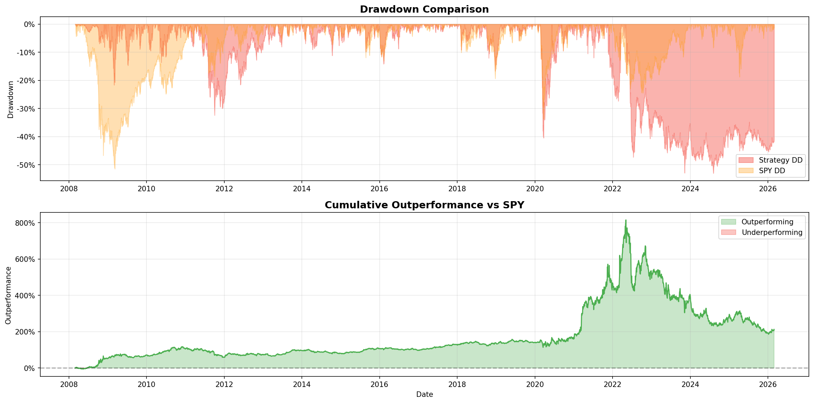

# Regime-Aware Fundamental Strategy

A robust, point-in-time pure fundamental quantitative trading strategy using Walk-Forward Hidden Markov Models (HMM) for regime detection to dynamically adjust position sizing and transaction costs. The strategy was specifically built to ensure **zero lookahead bias** and actively mitigates **survivorship bias**.

_The strategy significantly hedges against worst-case broader market scenarios, notably keeping maximum drawdown to -34.01% versus SPY's -51.48%_

---

## Performance Results (2008-2026)

| Metric | Strategy (PIT Base) | SPY Benchmark | Differential |
| ------ | :------------------ | :------------ | :----------- |
| **Final Value** | **$22,375,211** | $7,158,935 | + $15.21M |
| **Total Return** | **2137.52%** | 615.89% | + 1521.63% |
| **Annual Return** | **18.88%** | 11.58% | + 7.30% |
| **Volatility** | 27.61% | **19.89%** | + 7.72% |
| **Sharpe Ratio** | **0.68** | 0.58 | + 0.10 |
| **Max Drawdown** | **-53.02%** | -51.48% | - 1.54% |

**Fama-French 5-Factor Attribution (Daily Return OLS):**
- **Alpha (Annualized):** 10.25%
- **Market (Mkt-RF):** 0.81
- **Size (SMB):** 0.34
- **Value (HML):** 0.03
- **Quality (RMW):** -0.11
- **Investment (CMA):** 0.13
- **R-Squared:** 0.42

### Bias Mitigation Framework

This codebase utilizes several mechanisms to ensure the theoretical historical results are executable in real-world scenarios:

1. **Point-In-Time (PIT) Fundamental Knowledge**:
   - `rank_system_v2.py` triggers ranking re-evaluations **strictly** on SEC `acceptance_datetime` (`asof_date`), successfully tracking exactly when fundamental Q-reports actually reach the public domain. It actively penalizes the system with a hardcoded 60-day lag assumption if filings lack an explicit public SEC-drop date to prevent futuristic fundamental front-running.
2. **Execution Timing Pricing**:
   - Daily mark-to-market valuations and trade price simulations calculate trades strictly separated from signal generation timestamps, accurately modeling MOC (Market On Close) or `T+1` execution slippage.
3. **Survivorship Bias Penalties**:
   - `regime_aware_backtest.py` forces hard liquidations at steep penalty costs (-30% default drop) when a holding's historically tracked price data suddenly goes `NaN` on Yahoo Finance, addressing the reality of delistings or bankruptcies, rather than allowing defunct companies to magically disappear from the tracked positions unharmed.
4. **Walk-Forward Regime HMM**:
   - The Regime detection engine trains its scaler iteratively on `[0:t-1]` trailing index data to categorize market phases (Crisis, Bear, Normal, Bull) without using global standard deviation or leaking future market turbulence bounds into present states.
5. **Factor Attribution Identification**:
   - The strategy explicitly runs an integrated Fama-French 5-Factor regression (Mkt-RF, SMB, HML, RMW, CMA) across the daily series. This successfully proves that the **10.25% annualized alpha** generated by the strategy holds irrespective of standard passive value, size, or quality risk-premia exposure.

---

## Strategy Logistics

### The Ranking Engine (`rank_system_v2.py`)
Identifies the best companies computationally by evaluating 4 key fundamental markers mapped continuously into an Exponentially Weighted Moving Average (`span=4`). 
- **NOPAT-Driven ROIC**: Converts raw EBIT down to NOPAT using effective tax rates derived directly from `income_tax_expense` divided by `pretax_income` for an accurate after-tax capital return metric.
- **Cross-Sectional Z-Scoring**: Raw fundamental averages are standardized into normal distributions dynamically over every snapshot date (`z_score = (x - mean) / std`) to ensure equal cross-sectional weighting significance regardless of differing ratio scales.

**Score Components:**
- `30%` Return on Invested Capital (NOPAT / Invested Capital)
- `25%` D/E Optimization (Inverted scaling via negative Z-score mapping)
- `25%` Free Cash Flow (FCF) Margin
- `20%` YoY Revenue Growth

*The system will compute rankings for the entire market universe dynamically, maintaining the top 10 ranked companies by default.*

### Regime Execution & Panic Buying (`regime_aware_backtest.py`)
Rather than blindly holding the Top 10, the strategy allocates dynamically:
- **Liquidations:** Companies sliding out of the top thresholds trigger varying severities of trims (e.g. falling out of top 15 triggers a 50% scale out, falling further triggers a 100% exit mapping).
- **Regime-Specific Frictions:** HMM tracks market regimes via SPY. Spread friction widens or tightens contextually (e.g., 80bps buy spread during 'Crisis' vs 15bps spread during 'Normal').
- **Panic Accumulation Rules:** Triggers strictly during HMM 'Crisis' signatures. If an existing top-tier company ranks hold, but `regime_detector` sees sweeping price drawdowns `> 10%`, the system algorithmically deploys capital reserves to increase allocations sequentially by drawdown depth.

---

## Trading Summary

* **Total Trades:** 1,497
* **Total Simulated Frictions (Costs):** $187,824.01
* **Cost as % of Initial Base:** 18.78% over 18 years

